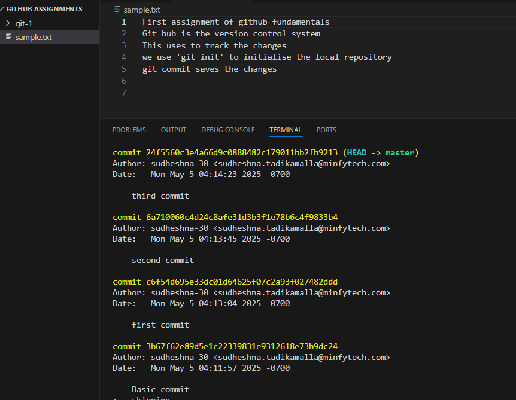

Objective - fundamentals of git commands and the workflow
File - sample.txt which contains 5 lines of text with several tracked changes.

commit history screenshot

changes made in each commit:
1. Basic commit - added a new file with 5 initial lines.
2. First commit - appended a new line of git basics to 'sample.txt'
3. second commit - removed the line which was added in last commit.
4. third commit - updated the first line in 'sample.txt' file

git commands used :
1.'git init'
2.'git add'
3.'git commit -m'
4.'git log'
5.'git diff'